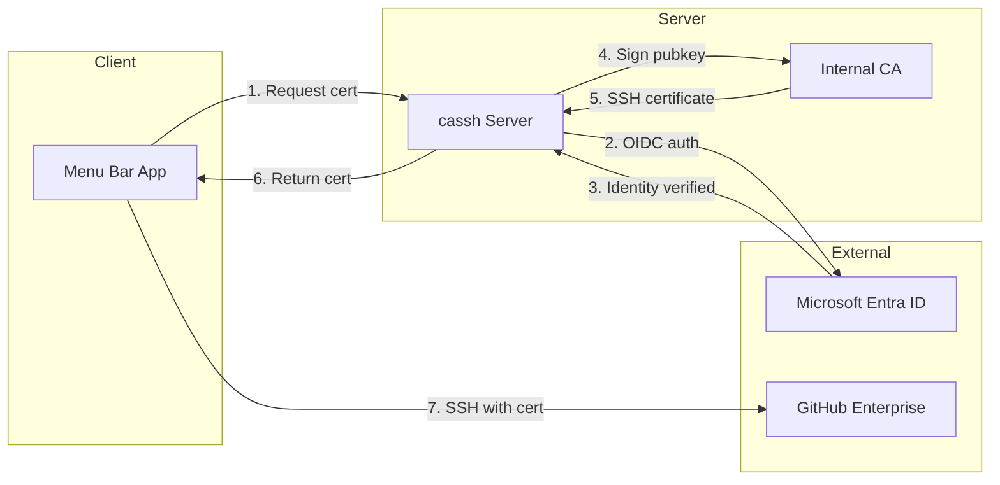

# cassh

  

**Ephemeral SSH Certificates for GitHub Enterprise**

`cassh` is an ephemeral SSH certificate system designed for GitHub Enterprise access. Instead of permanent SSH keys that require manual revocation, cassh issues short-lived certificates that automatically expire.

## How it works

1. **Authenticate** with Microsoft Entra (Azure AD)
2. **Obtain** a short-lived SSH certificate (12 hours)
3. **Certificate auto-expires** - no revocation needed

## Why cassh?

Permanent SSH keys are a liability. If a laptop is lost, stolen, or compromised:

| Scenario | With Permanent Keys | With cassh |
|----------|---------------------|------------|
| Laptop lost | Manual revocation required | Certificate expires automatically |
| Employee offboarding | Must track and revoke all keys | Certificates expire within hours |
| Key compromise | Often goes unnoticed | Limited blast radius |

## Features

- **Short-lived SSH certificates** - Signed by your internal CA, valid for 12 hours
- **Entra SSO Integration** - Sign in with your Microsoft identity
- **macOS Menu Bar App** - Shows cert status (green = valid, red = expired)
- **CLI for servers/CI** - Headless certificate generation
- **Meme Landing Page** - LSP or Flash Slothmore greet you on login

## Architecture

## Quick Links

- [Getting Started](getting-started.md) - Prerequisites and initial setup
- [Server Setup](server-setup.md) - CA keys, Entra app, configuration
- [Deployment](deployment.md) - Fly.io, Render, Railway, VPS options
- [Client Distribution](client.md) - MDM deployment, PKG/DMG builds
- [Configuration Reference](configuration.md) - All config options explained
- [Roadmap](roadmap.md) - Planned features and development status
